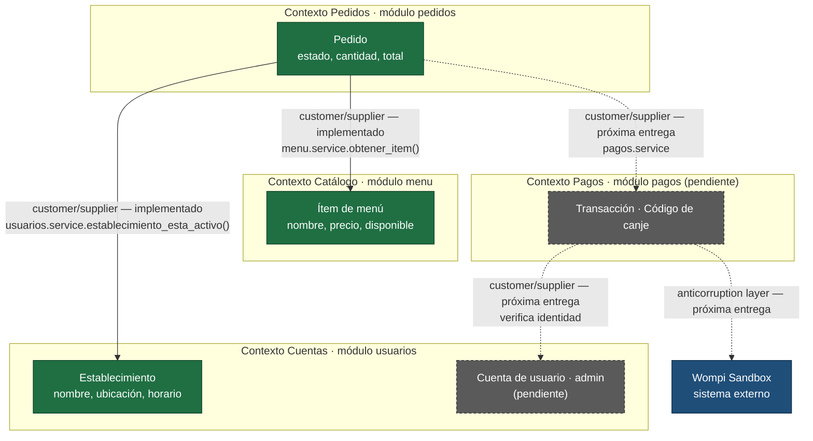

# Contextos delimitados y propiedad de datos — PideUTB (S6)

> Evidencia de la semana 6 (Dominio y modularidad). Referenciado desde
> [`arc42.md` §8](arc42/arc42.md#seccion-8) (Conceptos transversales).
> Este documento no reemplaza al [ADR-0001](adr/0001-estilo-arquitectonico.md),
> que sigue vigente: lo complementa, resolviendo límites de dominio que el
> corte 1 dejó implícitos.

El detalle de las violaciones detectadas, con su reproducción y su plan de
corrección, está en [`docs/violaciones.md`](violaciones.md).

## 1. Lenguaje ubicuo: dónde una misma palabra significa dos cosas

El lenguaje ubicuo no se define desde cero: se **audita** contra lo que el
equipo ya escribió en `docs/arc42/arc42.md` y en el código. Esta auditoría
encontró dos ambigüedades reales —no hipotéticas— dentro de la propia
documentación del proyecto.

| Término | Significado en un lugar | Significado en otro lugar | Dónde aparece la ambigüedad | Resolución |
|---|---|---|---|---|
| **«Usuario»** | Estudiante o profesor que compra comida, según el [glosario §12](arc42/arc42.md#glosario) | Cualquier cuenta del sistema, incluidos el personal de establecimiento y el administrador, según la responsabilidad del módulo `usuarios` en [arc42 §5.3](arc42/arc42.md#responsabilidad-modulos): *«Autenticación y roles (usuario: estudiante o profesor / establecimiento / admin)»* | Glosario vs. tabla de responsabilidad de módulos | Se distinguen dos términos: **«Usuario»** (negocio: solo estudiante o profesor, como ya decía el glosario) y **«Cuenta»** (técnico: cualquier actor autenticado — usuario, establecimiento o admin). El módulo `usuarios` gestiona **Cuentas** |
| **«Pedido» / «Carrito»** | `Pedido` es la única entidad que existe en el código (`backend/app/pedidos/models.py`), con estado inicial `pendiente_pago` | «Carrito» aparece en [ESC-05](arc42/arc42.md#esc-05) como algo que debe *«conservarse»* tras un error de pago, como si fuera distinto del pedido | Texto de ESC-05 vs. modelo de datos real | No se crea una entidad nueva: **«carrito» es sinónimo de «pedido en estado `pendiente_pago`»**, no una etapa previa. Si en una entrega futura el carrito necesita existir antes de tener ítem confirmado (para agregar varios productos), ahí sí se justificaría una entidad `Carrito` propia y este documento debe revisarse |

**Regla aplicada (concepto 01 de la semana):** si una regla de negocio necesita
un «salvo cuando» para que el término tenga sentido, probablemente hay dos
contextos. En ambos casos la ambigüedad se resuelve por **precisión de
nombres**, no creando un módulo nuevo: el tamaño actual del dominio no lo
justifica.

Ambas resoluciones quedan incorporadas al glosario de
[arc42 §12](arc42/arc42.md#glosario) y a [§8.1](arc42/arc42.md#seccion-8).

## 2. Mapa de contextos

Línea continua: implementado. Línea punteada: previsto.

**Por qué son estos contextos y no otros.** Cada uno corresponde a un grupo de
interesados con su propio vocabulario y ciclo de vida —el personal del
establecimiento habla de «productos y disponibilidad» (Catálogo), el usuario
habla de «mi pedido y mi pago» (Pedidos, Pagos), y la plataforma habla de
«cuentas y roles» (Cuentas)— y no de una división técnica arbitraria. Coinciden
uno a uno con los cuatro módulos ya decididos en ADR-0001: la auditoría no
encontró ningún límite que exigiera un módulo adicional.

**Tipos de relación.**

| Relación | Patrón | Estado | Justificación |
|---|---|---|---|
| Pedidos → Catálogo | **customer/supplier** | Implementada | Pedidos pide, Catálogo responde con su lenguaje publicado. Ninguno escribe datos del otro |
| Pedidos → Cuentas | **customer/supplier** | Implementada | Pedidos consulta si el establecimiento opera; Cuentas es su único escritor |
| Pedidos → Pagos | **customer/supplier** | Próxima entrega | Pedidos solicitará el cobro y leerá el resultado |
| Pagos → Cuentas | **customer/supplier** | Próxima entrega | Para verificar quién redime un código |
| Pagos → Wompi | **anticorruption layer** | Próxima entrega | Único caso que la justifica: el modelo de la pasarela es ajeno e inestable y puede cambiar sin avisarnos. Wompi no debe aparecer dentro del dominio |

**No se usa shared kernel en ninguna relación.** Sería el patrón adecuado si dos
contextos compartieran un modelo que **ambos escriben**, y obliga a coordinar
cada cambio entre los dos dueños. Aquí ningún dato tiene dos escritores, así que
introducirlo solo añadiría coordinación sin resolver nada.

**Sobre Supabase:** compartir base de datos no autoriza a compartir tablas. Cada
contexto escribe únicamente las tablas de su prefijo (`menu_*`, `pedidos_*`,
`pagos_*`, `usuarios_*`). Es la vía más fácil de anular la modularidad sin que
se note en la estructura de carpetas, y por eso se declara como regla explícita.

## 3. Tabla de propiedad de datos (módulo → dato, dueño único)

Cada dato tiene **exactamente un módulo que lo escribe**; los demás lo **leen o
lo solicitan**. Cualquier dato con dos escritores es una violación.

| Dato | Módulo dueño (único escritor) | Módulos lectores | Cómo lo consultan | Estado |
|---|---|---|---|---|
| **Ítem de menú** (`nombre`, `precio_centavos`, `disponible`) | `menu` | `pedidos` | `menu.service.obtener_item()` → `ItemDisponible` | ✅ Implementado y auditado |
| **Pedido** (`estado`, `cantidad`, `total_centavos`, instantáneas) | `pedidos` | `pagos` | `pedidos.service` → `PedidoPublicado` | ✅ Implementado |
| **Código de canje** | `pedidos` | `pagos`, panel del establecimiento | `pedidos.service.confirmar_pago()` y el evento `pedido.pagado` | ✅ Implementado en S7 |
| **Establecimiento** (`nombre`, `ubicación`, `horario`, `activo`) | `usuarios` | `menu`, `pedidos` (solo la referencia `establecimiento_id`) | `usuarios.service.obtener_establecimiento()` · `establecimiento_esta_activo()` | ✅ Implementado en esta entrega — ver [ADR-0002](adr/0002-propiedad-datos-establecimiento.md) |
| **Cuenta** (`usuario`, `admin`: credenciales y rol) | `usuarios` | `menu`, `pedidos`, `pagos` (para validar identidad) | `usuarios.service.*` | ⏳ Pendiente |
| **Intento de pago** (`referencia_pago`, `monto_centavos`, `estado_pago`) | `pagos` | — | `pagos.service.*` | ✅ Implementado en S7 |

**Regla verificada: ningún dato tiene hoy dos escritores.** `Establecimiento`
tenía **cero** —lo cual es igual de peligroso, porque cualquier módulo futuro
podía adoptarlo por conveniencia y acabar duplicándolo—, y S6 le asignó dueño.

### Reajuste de S7: el código de canje es de Pedidos, no de Pagos

La tabla de S6 asignaba «Transacción / código de canje» a `pagos`. Al
implementar el contexto se vio que **son dos datos distintos con dueños
distintos**:

- El **intento de pago** es un hecho del contexto Pagos: qué se mandó a cobrar,
  por qué método y cómo acabó.
- El **código de canje** es un atributo del `Pedido`. Lo acredita, lo presenta
  el usuario al recogerlo y su ciclo de vida es el del pedido, no el del cobro.

Si `pagos` escribiera el código de canje habría dos escritores de `Pedido`, que
es exactamente la violación que ADR-0002 cerró. Por eso `pagos.service`
**solicita** la transición a `pedidos.service.confirmar_pago()` en lugar de
ejecutarla, y es Pedidos quien genera el código y garantiza que hacerlo dos
veces no produzca dos códigos distintos.

### Datos que Pedidos copia de Catálogo

`Pedido` guarda `nombre_item`, `precio_unitario` y `total`, derivados del
catálogo. **No es una escritura compartida**: Catálogo sigue siendo el único que
escribe `ItemMenu`; Pedidos copia el valor una vez, como registro histórico. Y
debe congelarlo, porque un pedido ya realizado no puede cambiar de importe si el
establecimiento sube el precio mañana.

| Campo del pedido | Origen | ¿Se desincroniza? |
|---|---|---|
| `nombre_item` | `ItemMenu.nombre` | Sí, y es correcto: el comprobante dice qué se compró |
| `precio_unitario_centavos` | `ItemMenu.precio_centavos` | Sí, y es correcto: congela el precio pactado |
| `total_centavos` | `precio_unitario_centavos × cantidad` | Sí, y es correcto: congela el importe cobrado |
| `establecimiento_id` | `ItemMenu.establecimiento_id` | **No debe**: se deriva del ítem en cada creación |

Lo comprueba
`tests/test_propiedad_datos.py::test_el_pedido_conserva_el_precio_aunque_cambie_el_catalogo`.

## 4. Auditoría de modularidad del código actual

**Método.** Dos revisiones complementarias, porque la regla de ADR-0001 se puede
romper de dos maneras distintas:

1. **Qué importa cada módulo** — que ninguno importe el `repository.py` o el
   `models.py` de otro.
2. **Qué tipos cruzan la frontera** — que una función pública no devuelva una
   entidad interna, porque entonces el modelo del vecino aparece dentro del
   propio aunque no haya ningún import ilegal.

| Módulo revisado | ¿Importa de otro módulo? | ¿Solo superficie pública? | Cumple |
|---|---|---|---|
| `pedidos/service.py` | `app.menu.service`, `app.usuarios.service` | Sí | ✅ |
| `pedidos/router.py` | Solo `app.pedidos.*` | N/A | ✅ |
| `menu/service.py`, `menu/router.py` | Solo `app.menu.*` | N/A | ✅ |
| `usuarios/service.py` | Solo `app.usuarios.*` | N/A | ✅ |
| `pagos` | Módulo vacío | N/A | N/A |

**La regla ya no depende de la disciplina del equipo.**
`backend/tests/test_modularidad.py` recorre el árbol de sintaxis de cada archivo
de `app/` y falla la construcción si un módulo importa de otro algo que no sea
`service` o `contracts`. Incluye su propio caso negativo, y se comprobó a mano
que detecta las tres formas de violación (`from X.repository import`,
`from X import repository as`, `import X.models`).

**Resultado de la auditoría:** 9 violaciones detectadas, 6 corregidas en esta
entrega con prueba automatizada, 3 planificadas. El detalle, con la reproducción
de cada una, está en [`docs/violaciones.md`](violaciones.md).

Las tres de mayor calado fueron:

| ID | Hallazgo | ¿Dos escritores? |
|---|---|---|
| **H-1** | `pedidos.Pedido` copia `nombre_item` de `menu.ItemMenu` | No — `menu` sigue siendo el único escritor; es un registro histórico. El defecto real era que la instantánea no guardaba el precio unitario y resultaba inauditable ([V-06](violaciones.md#v-06)) |
| **H-2** | `establecimiento_id` se almacenaba suelto, sin que ningún módulo fuera dueño de los datos del establecimiento | Era una brecha de **cero dueños**, no de dos. Y tenía consecuencia inmediata: el cliente podía elegir el establecimiento del pedido ([V-01](violaciones.md#v-01)). Resuelto en [ADR-0002](adr/0002-propiedad-datos-establecimiento.md) |
| **H-3** | Ambigüedad de «Usuario» y «Pedido»/«Carrito» (§1) | No es violación de código, es violación de lenguaje ubicuo. Resuelta en el glosario y en arc42 §8.1 |

## 5. Preguntas guía respondidas

> **¿Qué palabra de vuestro dominio significa dos cosas según con quién habléis?**

**«Usuario».** Para quien lee el glosario es «estudiante o profesor que compra
comida»; para quien lee la responsabilidad del módulo `usuarios` es «cualquier
cuenta autenticada, incluidos el establecimiento y el admin». La solución no es
imponer un único significado, sino nombrar ambos conceptos por separado:
**Usuario** (negocio) y **Cuenta** (técnico, superconjunto que incluye Usuario,
Establecimiento y Admin).

> **¿Qué dato de vuestro sistema tiene hoy más de un escritor?**

**Ninguno.** Pero `Establecimiento` tenía **cero**, que es el estado previo más
probable a terminar con dos: en cuanto `pagos` y `usuarios` necesitaran mostrar
el nombre del establecimiento, lo natural habría sido que cada uno guardara su
propia copia. Esta entrega le asigna dueño antes de que eso ocurra.

> **Si tuvierais que extraer un servicio mañana, ¿cuál sería el que menos duele?**

**`menu` (Catálogo).** Nadie lo escribe desde fuera, expone una única función de
lectura, no depende de ningún otro contexto y su lenguaje publicado
(`ItemDisponible`) ya tiene la forma de una respuesta HTTP, porque se definió
pensando en esta frontera. Extraerlo sería convertir una llamada en proceso en
una llamada de red, sin romper ningún contrato.

El que **más** dolería es `pagos`, aunque todavía no exista: tendrá que
coordinar el estado del pedido con el resultado de la pasarela, y esa
coordinación entre dos servicios exige consistencia eventual y compensaciones
que hoy no hacen falta.
